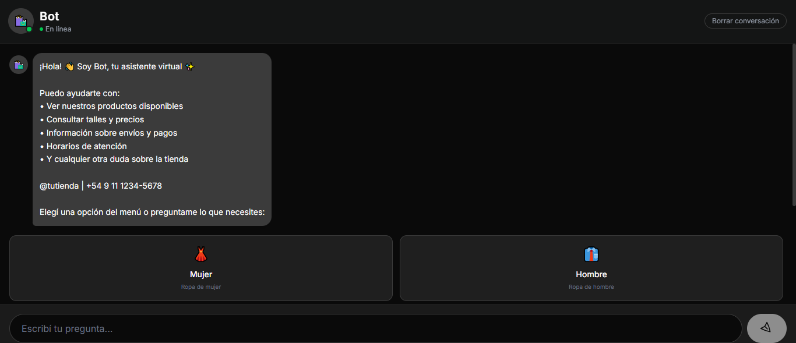
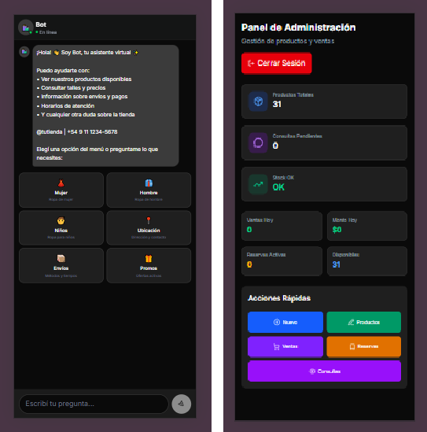
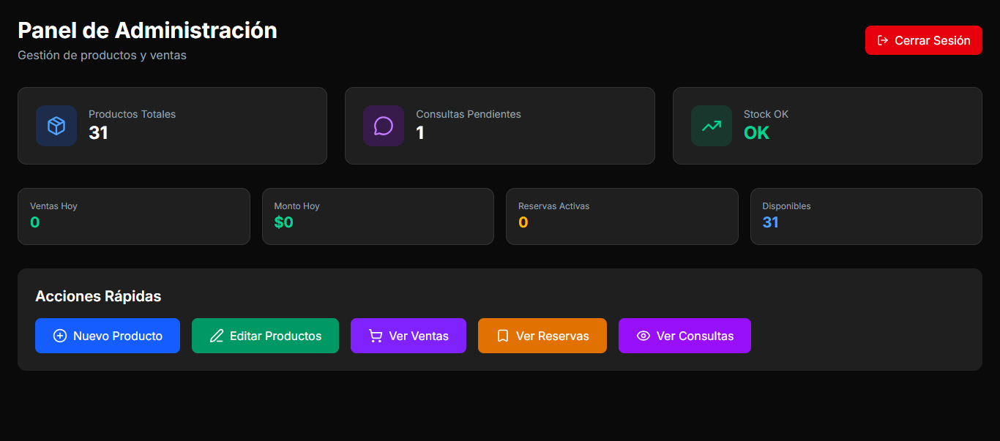
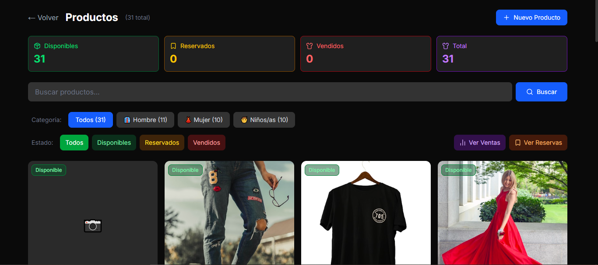

# 🧠 ShopBot AI

<div align="center">

[](https://gemini.google.com)
[](https://nextjs.org)
[](https://react.dev)
[](https://typescriptlang.org)
[](https://tailwindcss.com)
[](https://sqlite.org)
[](https://vitest.dev)
[](https://vitest.dev)
[](LICENSE)
[](https://github.com/MarceloAdan73/botShop-AI/stargazers)

> 🤖 **AI Chatbot** · 📦 **E-commerce** · 💰 **Reservations & Sales** · 🛡️ **Admin Panel**

AI-powered virtual assistant for clothing stores, powered by **Google Gemini 2.5 Flash**, with complete product, reservation, and sales management.

</div>

---

## ✨ Features

| Feature | Description |
|---------|-------------|
| 🧠 **AI Chatbot** | Intelligent virtual assistant powered by Google Gemini 2.5 Flash with full inventory context |
| 📦 **Product Management** | Full CRUD with images, categories, sizes, and stock control |
| 💰 **Reservation System** | Product reservations with expiration dates, status tracking |
| 📊 **Sales Tracking** | Sales logging, payment methods, period statistics |
| 💬 **Customer Inquiries** | Automatic conversation logging, mark as handled |
| 🛡️ **Security** | Cookie authentication, rate limiting (Upstash Redis) |
| 📱 **Responsive Design** | Mobile and desktop optimized interface |
| ✅ **Quality** | 12 passing tests, TypeScript strict |

---

## 📸 Screenshots

### Chat - Bot Interface

| Desktop | Mobile |
|---------|-------|
|  |  |

### Admin Panel

| Dashboard | Products |
|------------|-----------|
|  |  |

---

## 🚀 Quick Start

### Prerequisites
- Node.js 18.x or higher

### Installation

```bash
git clone https://github.com/MarceloAdan73/botShop-AI.git
cd botShop-AI
npm install
cp .env.example .env.local
```

### Run

```bash
npm run dev
npm run seed    # Load 30 sample products
```

Open [http://localhost:3000](http://localhost:3000)

---

## ⚙️ Configuration

### Environment Variables

```env
# Google Gemini API (required)
# ⚠️ The example key is a TEST key with very low limits
# Get your own key at: https://aistudio.google.com/app/apikey
GEMINI_API_KEY=your_api_key_here

# Rate limiting (optional)
UPSTASH_REDIS_REST_URL=https://xxx.upstash.io
UPSTASH_REDIS_REST_TOKEN=xxx

# Admin
ADMIN_PASSWORD=demo123
```

### 🤖 AI Models

> ⚠️ The free API key has very low limits. For production, get your own key.

| Model | Speed | Intelligence |
|--------|-----------|--------------|
| Gemini 2.0 Flash | ⚡⚡⚡ | ⭐⭐ |
| **Gemini 2.5 Flash** | ⚡⚡ | ⭐⭐⭐ (current) |
| Gemini 2.5 Pro | ⚡ | ⭐⭐⭐⭐ |

Change the model in `src/app/api/chat/route.ts` line 72.

---

## 📁 Project Structure

```
botShop-AI/
├── src/app/
│   ├── page.tsx              # Chat UI
│   ├── admin/                # Admin panel
│   │   ├── productos/        # Product CRUD
│   │   ├── reservas/         # Reservations
│   │   ├── ventas/           # Sales
│   │   └── consultas/        # Conversations
│   └── api/                  # API routes
├── src/lib/
│   ├── db.ts                 # SQLite
│   ├── models.ts             # Models
│   ├── redis.ts              # Rate limiting
│   └── tienda-config.ts      # Store config
├── tests/                    # Vitest
├── seed.ts                   # Sample data
└── package.json
```

---

## 🏗️ Architecture

### Tech Stack

| Category | Technology | Purpose |
|-----------|------------|----------|
| **Framework** | Next.js 16 | App Router, Server Actions |
| **UI** | React 19 | Components |
| **Language** | TypeScript | Static typing |
| **Styles** | Tailwind CSS 4 | Utility-first CSS |
| **Icons** | Lucide React | Icons |
| **Notifications** | React Hot Toast | Toasts |
| **Database** | better-sqlite3 | SQLite ORM |
| **AI** | Google Gemini SDK | AI Chatbot |
| **Rate Limiting** | Upstash Redis | API Protection |
| **Testing** | Vitest | Unit tests |
| **PostgreSQL** | pg (ready) | Production migration |
| **Runner** | tsx | Run TypeScript scripts |

### Design Patterns
- **Server Actions** - mutations without intermediate API routes
- **MVC** - typed models in `/lib/models.ts`
- **Fail-open** - optional services (Redis) don't break the app
- **WAL Mode** - SQLite with write-ahead logging for better performance

---

## 🔌 API Endpoints

### Chat (Public)
| Method | Endpoint | Description |
|--------|----------|-------------|
| `POST` | `/api/chat` | Send message to chatbot |
| `POST` | `/api/chat/save` | Save conversation |

### Admin (Authenticated)
| Method | Endpoint |
|--------|----------|
| `GET/POST` | `/api/admin/products` |
| `GET/PUT/DELETE` | `/api/admin/products/[id]` |
| `GET/POST` | `/api/admin/reservas` |
| `GET/POST` | `/api/admin/ventas` |
| `GET` | `/api/admin/conversaciones` |

---

## 🗄️ Database Schema

```sql
Category (id, name, slug, icon, talles)
Product (id, name, price, stock, categoryId, imageUrl, talles, estado)
Reserva (id, producto_id, nombre_cliente, fecha_reserva, estado)
Venta (id, producto_id, nombre_cliente, metodo_pago, precio_venta)
Conversation (id, mensajes JSON, necesita_atencion)
Config (id, storeInfo JSON)
```

---

## 🧪 Testing

```bash
npm test        # Watch mode
npm run test:run
```

---

## 🐳 Deployment

### Vercel
```bash
vercel --prod
```

### Docker
```bash
docker build -t botshop-ai .
docker run -p 3000:3000 botshop-ai
```

---

## 🗺️ Roadmap

### ✅ Completed
- [x] AI Chatbot with Gemini
- [x] Product CRUD
- [x] Reservations and sales
- [x] Admin panel
- [x] Rate limiting

### 📋 Planned
- [ ] PostgreSQL/Supabase
- [ ] Dashboard with charts
- [ ] WhatsApp integration
- [ ] Mercado Pago
- [ ] Multi-store (SaaS)

---

## ☁️ Production

See full guide in the repository to migrate to **Supabase + Vercel**:

1. Create Supabase project
2. Configure environment variables
3. Update `db.ts` for PostgreSQL
4. Deploy to Vercel

---

## 📄 License

MIT - see [LICENSE](LICENSE)

---

## 👤 Author

**Marcelo Adan**  
[](https://github.com/MarceloAdan73)

---

<div align="center">
  <a href="#-botshop-ai">⬆️ Back to top</a>
</div>
